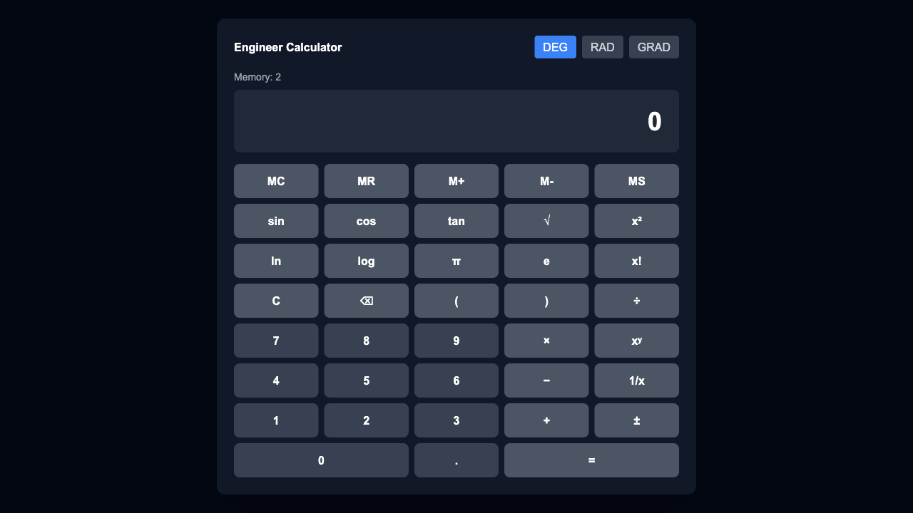

# Engineer Calculator

Advanced scientific calculator for engineers with history, statistics, and unit conversion capabilities.



## ✨ Features

### Core Calculator
- Scientific calculator with advanced mathematical operations
- Trigonometric functions (sin, cos, tan, asin, acos, atan)
- Support for multiple angle modes (degrees, radians, gradians)
- Logarithmic functions (ln, log10)
- Power, root, and factorial operations
- Memory operations (MC, MR, M+, M-, MS)
- Keyboard shortcuts support

### History & Statistics
- Automatic calculation history tracking
- Statistical analysis (average, median, min, max, sum)
- Search and filter capabilities
- LocalStorage persistence
- Quota management for optimal performance

### Unit Converter
- 5 categories: Length, Weight, Temperature, Volume, Area
- Smart temperature conversion with offset handling
- Extensible conversion table system

## 🛠️ Tech Stack

- **Framework**: Next.js 14 with App Router
- **Language**: TypeScript
- **Styling**: Tailwind CSS
- **State Management**: Zustand with persistence
- **Math Engine**: Math.js
- **Testing**: Jest, React Testing Library, Playwright
- **Code Quality**: ESLint, Prettier

## 📊 Test Coverage

```
✅ 157 tests passing
✅ 10 test suites
✅ Core Calculator: 56 tests
✅ State Management: 26 tests
✅ UI Components: 38 tests
✅ History & Statistics: 32 tests
✅ Utilities: 5 tests
```

## 🚀 Getting Started

```bash
# Install dependencies
npm install

# Run development server
npm run dev

# Open browser at http://localhost:3000

# Run tests
npm test

# Run tests with coverage
npm run test:coverage

# Run E2E tests
npm run test:e2e

# Build for production
npm run build

# Start production server
npm start
```

## 💡 Development Methodology

This project was built following TDD (Test-Driven Development) with parallel execution strategy:

### TDD Cycle
1. **RED**: Write failing tests
2. **GREEN**: Implement code to pass tests
3. **REFACTOR**: Improve code quality

### Parallel Development
- Phase 1: Core Calculator (3 parallel tracks)
  - Track A: Calculator Engine
  - Track B: State Management
  - Track C: UI Components
- Phase 2: Advanced Features (2 parallel tracks)
  - Track A: History & Statistics
  - Track B: Unit Converter

See [PARALLEL_EXECUTION_STRATEGY.md](./docs/PARALLEL_EXECUTION_STRATEGY.md) for detailed development strategy.

## Project Structure

```
├── app/              # Next.js app router pages
├── components/       # React components
├── lib/              # Business logic
│   ├── calculator/   # Calculator engine
│   ├── converter/    # Unit converter
│   ├── storage/      # History storage
│   └── utils/        # Utilities
├── store/            # Zustand state management
├── types/            # TypeScript types
├── __tests__/        # Unit & integration tests
└── e2e/              # E2E tests
```

## License

MIT
